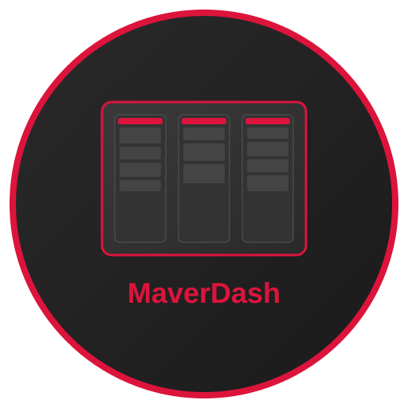

# Mavit - Kanban Board Application

<div align="center">



**Uma aplicação de quadro Kanban elegante e poderosa para gerenciar suas tarefas e projetos**

[](LICENSE)
[](https://electronjs.org/)
[](https://reactjs.org/)
[](https://typescriptlang.org/)

[📥 Downloads](RELEASES.md) • [🚀 Instalação](#instalação) • [📖 Como Usar](#como-usar) • [🛠️ Desenvolvimento](#desenvolvimento)

</div>

## 🌟 Características Principais

- **🎯 Interface Intuitiva**: Design moderno e minimalista com tema escuro
- **🔄 Drag & Drop**: Mova cartões e colunas facilmente
- **⚡ Sistema de Prioridades**: Organize tarefas por prioridade (baixa, média, alta)
- **📅 Datas de Vencimento**: Defina prazos e visualize tarefas em atraso
- **💾 Salvamento Automático**: Seus dados são salvos automaticamente
- **📊 Múltiplos Quadros**: Crie quantos quadros precisar
- **🎨 Personalização**: Cores customizáveis para colunas
- **📁 Import/Export**: Backup e restauração de dados em JSON
- **🖥️ Multiplataforma**: Windows, Linux e macOS

## 📸 Capturas de Tela

### Tela Principal
*[INSERIR CAPTURA DE TELA DA TELA PRINCIPAL AQUI]*

> Interface principal mostrando múltiplas colunas com cartões organizados

### Sistema de Prioridades
*[INSERIR CAPTURA DE TELA DO SISTEMA DE PRIORIDADES AQUI]*

> Cartões com indicadores visuais de prioridade e datas de vencimento

### Criação de Quadros
*[INSERIR CAPTURA DE TELA DA CRIAÇÃO DE QUADROS AQUI]*

> Modal para criação de novos quadros com emojis personalizados

### Gerenciamento de Cartões
*[INSERIR CAPTURA DE TELA DO GERENCIAMENTO DE CARTÕES AQUI]*

> Interface para criar e editar cartões com todas as opções disponíveis

### Sidebar e Navegação
*[INSERIR CAPTURA DE TELA DA SIDEBAR AQUI]*

> Navegação entre quadros com sidebar recolhível

## 📥 Download

### Releases Oficiais

| Plataforma | Download | Tamanho | Requisitos |
|------------|----------|---------|------------|
| **Windows** | [Mavit-Setup.exe](releases/latest) | ~150MB | Windows 10+ |
| **Linux** | [Mavit.AppImage](releases/latest) | ~160MB | Qualquer distribuição |
| **Linux (DEB)** | [mavit.deb](releases/latest) | ~150MB | Ubuntu/Debian |

### Verificação de Integridade
```bash
# Para verificar a integridade dos arquivos baixados
sha256sum Mavit-Setup.exe
sha256sum Mavit.AppImage
```

## 🚀 Instalação

### Windows

1. **Baixe o instalador** `Mavit-Setup.exe`
2. **Execute como administrador** (clique direito → "Executar como administrador")
3. **Siga o assistente de instalação**:
   - Escolha o diretório de instalação
   - Marque "Criar atalho na área de trabalho" se desejar
   - Clique em "Instalar"
4. **Inicie o aplicativo** pelo atalho criado ou menu Iniciar

#### Instalação Silenciosa (Opcional)
```cmd
Mavit-Setup.exe /S /D=C:\Program Files\Mavit
```

### Linux

#### Método 1: AppImage (Recomendado)
```bash
# Baixe o arquivo AppImage
wget https://github.com/seu-usuario/mavit/releases/latest/download/Mavit.AppImage

# Torne executável
chmod +x Mavit.AppImage

# Execute
./Mavit.AppImage
```

#### Método 2: Pacote DEB (Ubuntu/Debian)
```bash
# Baixe o pacote
wget https://github.com/seu-usuario/mavit/releases/latest/download/mavit.deb

# Instale
sudo dpkg -i mavit.deb

# Resolva dependências se necessário
sudo apt-get install -f

# Execute
mavit
```

#### Criação de Atalho no Desktop (AppImage)
```bash
# Crie o arquivo de desktop
cat > ~/.local/share/applications/mavit.desktop << EOF
[Desktop Entry]
Name=Mavit
Comment=Kanban Board Application
Exec=/caminho/para/Mavit.AppImage
Icon=/caminho/para/icon.png
Terminal=false
Type=Application
Categories=Office;ProjectManagement;
EOF
```

## 📖 Como Usar

### Primeiros Passos

1. **Primeira Execução**
   - Ao abrir o Mavit, você verá a tela de boas-vindas
   - Clique em "Criar Seu Primeiro Quadro" para começar

*[INSERIR CAPTURA DE TELA DA TELA DE BOAS-VINDAS AQUI]*

2. **Criando um Quadro**
   - Escolha um nome para seu quadro
   - Adicione uma descrição (opcional)
   - Selecione um emoji para identificar visualmente
   - Clique em "Criar Quadro"

*[INSERIR CAPTURA DE TELA DA CRIAÇÃO DE QUADRO AQUI]*

### Gerenciando Colunas

1. **Adicionar Coluna**
   - Clique no botão "Adicionar Coluna" no cabeçalho
   - Digite o nome da coluna (ex: "A Fazer", "Em Andamento", "Concluído")
   - Escolha uma cor para identificação
   - Adicione uma descrição se necessário

*[INSERIR CAPTURA DE TELA DA CRIAÇÃO DE COLUNA AQUI]*

2. **Reordenar Colunas**
   - Arraste as colunas pela área do cabeçalho
   - A posição será salva automaticamente

### Trabalhando com Cartões

1. **Criar Cartão**
   - Clique no botão "+" em qualquer coluna
   - Preencha as informações:
     - **Título**: Nome da tarefa
     - **Descrição**: Detalhes adicionais
     - **Prioridade**: Baixa (azul), Média (amarelo), Alta (vermelho)
     - **Data de Vencimento**: Formato dd/mm/aa

*[INSERIR CAPTURA DE TELA DA CRIAÇÃO DE CARTÃO AQUI]*

2. **Mover Cartões**
   - Arraste e solte cartões entre colunas
   - Cartões são automaticamente ordenados por prioridade

3. **Editar Cartões**
   - Clique no ícone de edição no cartão
   - Modifique as informações conforme necessário
   - Alterações são salvas automaticamente

### Recursos Avançados

#### Sistema de Prioridades
- **Alta** 🔴: Tarefas urgentes (aparecem no topo, com animação pulsante)
- **Média** 🟡: Tarefas importantes
- **Baixa** 🔵: Tarefas de rotina

*[INSERIR CAPTURA DE TELA DO SISTEMA DE PRIORIDADES AQUI]*

#### Datas de Vencimento
- Cartões mostram ícone de calendário 📅
- Tarefas em atraso ficam vermelhas com ícone de alerta ⚠️
- Use formato dd/mm/aa (ex: 25/12/24)

#### Backup e Restauração
1. **Exportar Dados**
   - Vá para Configurações → Exportar Dados
   - Escolha local para salvar o arquivo JSON
   - Arquivo contém todos os quadros e configurações

2. **Importar Dados**
   - Vá para Configurações → Importar Dados
   - Selecione o arquivo JSON de backup
   - Dados serão restaurados automaticamente

*[INSERIR CAPTURA DE TELA DO BACKUP/RESTORE AQUI]*

## ⌨️ Atalhos de Teclado

| Ação | Atalho | Descrição |
|------|---------|-----------|
| Novo Quadro | `Ctrl + N` | Criar novo quadro |
| Nova Coluna | `Ctrl + Shift + N` | Adicionar coluna ao quadro atual |
| Novo Cartão | `Ctrl + M` | Criar novo cartão |
| Buscar | `Ctrl + F` | Buscar em todos os quadros |
| Alternar Sidebar | `Ctrl + B` | Mostrar/ocultar sidebar |
| Configurações | `Ctrl + ,` | Abrir configurações |

## 🛠️ Solução de Problemas

### Windows

**Problema**: Antivírus bloqueia a instalação
- **Solução**: Adicione exceção para Mavit no seu antivírus
- **Motivo**: Aplicações Electron podem ser falsamente detectadas

**Problema**: Erro "Aplicativo não foi encontrado"
- **Solução**: Reinstale o aplicativo como administrador
- **Verifique**: Se todos os arquivos foram extraídos corretamente

### Linux

**Problema**: AppImage não executa
```bash
# Verifique permissões
ls -la Mavit.AppImage

# Torne executável
chmod +x Mavit.AppImage

# Execute com debug
./Mavit.AppImage --verbose
```

**Problema**: Dependências em falta (DEB)
```bash
# Instale dependências
sudo apt-get install -f

# Para Ubuntu mais antigo
sudo apt-get install libgtk-3-0 libnss3 libxss1
```

**Problema**: Ícone não aparece no menu
```bash
# Atualize cache de ícones
sudo update-desktop-database
sudo gtk-update-icon-cache -f -t /usr/share/icons/hicolor/
```

### Problemas Gerais

**Dados perdidos**
- **Prevenção**: Use a função de backup regularmente
- **Localização**: `%APPDATA%/mavit` (Windows) ou `~/.config/mavit` (Linux)

**Performance lenta**
- **Solução**: Feche outros aplicativos pesados
- **Recomendado**: Pelo menos 4GB RAM disponível

## 🔧 Desenvolvimento

### Requisitos
- Node.js 18+
- npm 8+
- Git

### Configuração do Ambiente
```bash
# Clone o repositório
git clone https://github.com/seu-usuario/mavit.git
cd mavit

# Instale dependências
npm install

# Inicie em modo desenvolvimento
npm run dev

# Para Linux (recomendado no Linux)
npm run dev:linux
```

### Scripts Disponíveis
```bash
# Desenvolvimento
npm run dev              # Inicia React + Electron
npm run dev:react        # Apenas React
npm run dev:electron     # Apenas Electron

# Build
npm run build            # Build completo
npm run build:react      # Build React
npm run build:electron   # Build Electron

# Distribuição
npm run release          # Gera instaladores para a plataforma atual
npm run release:all      # Gera para todas as plataformas
npm run release:win      # Apenas Windows
npm run release:linux    # Apenas Linux

# Qualidade de código
npm run lint             # ESLint
```

### Estrutura do Projeto
```
mavit/
├── src/                 # Código fonte React
│   ├── components/      # Componentes React
│   ├── store/          # Gerenciamento de estado (Zustand)
│   ├── types/          # Definições TypeScript
│   └── utils/          # Funções utilitárias
├── electron/           # Código Electron
├── assets/             # Ícones e recursos
├── build/              # Configurações de build
└── scripts/            # Scripts de automação
```

### Contribuindo
1. Faça fork do projeto
2. Crie uma branch para sua feature (`git checkout -b feature/nova-feature`)
3. Commit suas mudanças (`git commit -am 'Adiciona nova feature'`)
4. Push para a branch (`git push origin feature/nova-feature`)
5. Abra um Pull Request

## 📄 Licença

Este projeto está licenciado sob a Licença MIT - veja o arquivo [LICENSE](LICENSE) para detalhes.

## 🤝 Suporte

### Reportar Bugs
- [Abra uma issue](https://github.com/seu-usuario/mavit/issues/new?template=bug_report.md)
- Inclua capturas de tela e logs quando possível

### Solicitações de Features
- [Solicite uma feature](https://github.com/seu-usuario/mavit/issues/new?template=feature_request.md)
- Descreva detalhadamente o que gostaria de ver

### Comunidade
- [Discussões](https://github.com/seu-usuario/mavit/discussions)
- [Wiki](https://github.com/seu-usuario/mavit/wiki)

## 🏆 Reconhecimentos

- **Electron** - Framework para aplicações desktop
- **React** - Biblioteca para interfaces de usuário
- **@dnd-kit** - Biblioteca de drag and drop
- **Framer Motion** - Animações fluidas
- **Zustand** - Gerenciamento de estado simples
- **Tailwind CSS** - Framework CSS utilitário

---

<div align="center">

**Feito com ❤️ pela equipe Maver**

[⬆ Voltar ao topo](#mavit---kanban-board-application)

</div>
